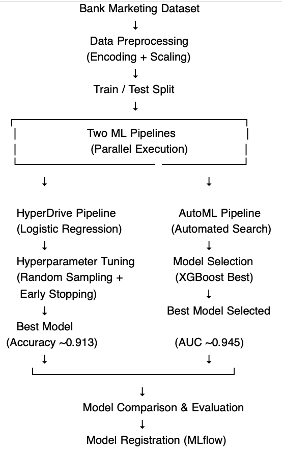
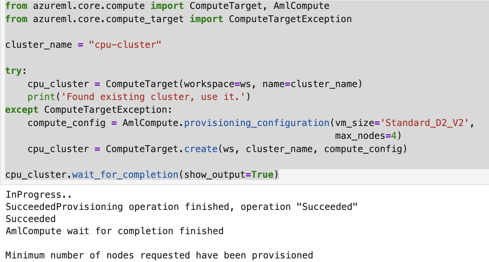
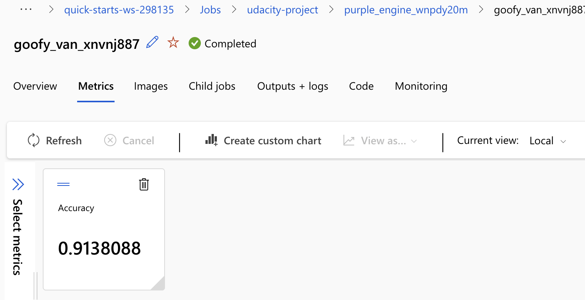
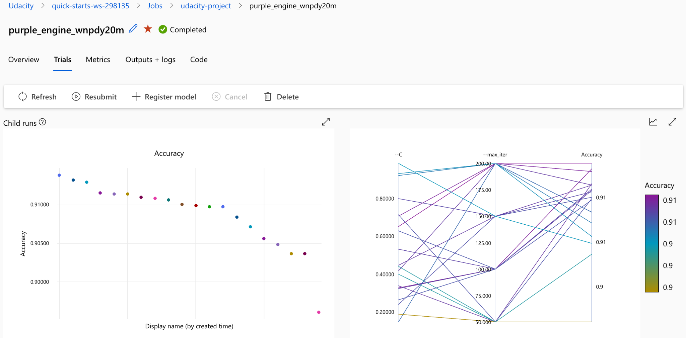
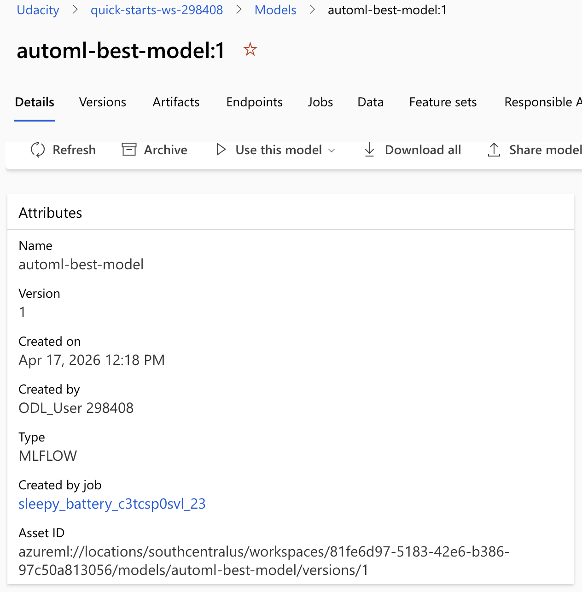
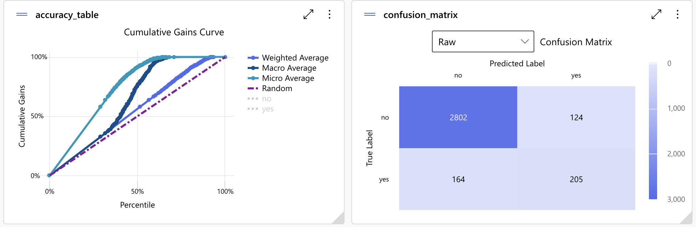
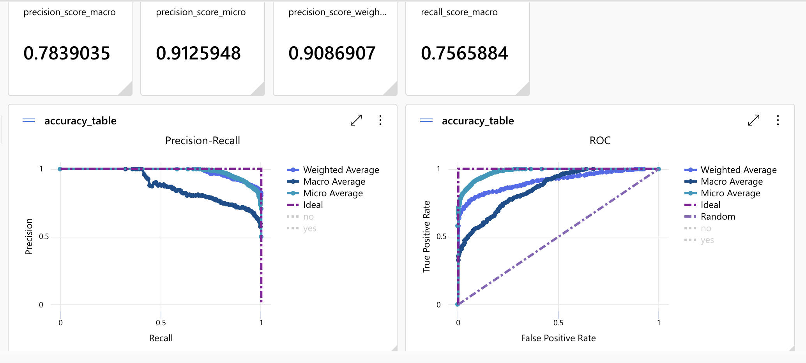
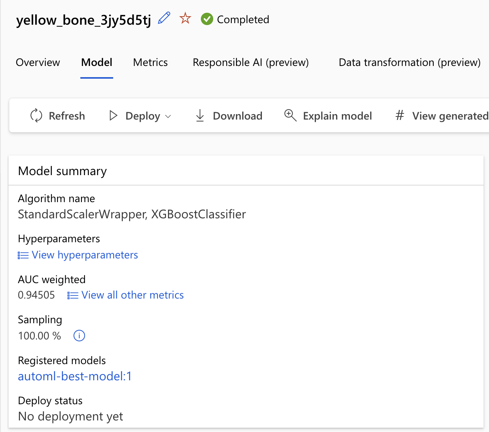

# Bank Marketing Prediction using Azure Machine Learning

## Project Overview

This project focuses on building and comparing two machine learning pipelines using Azure Machine Learning to predict whether a client will subscribe to a term deposit. The dataset used is the Bank Marketing dataset.

Two approaches were implemented. The first approach uses HyperDrive with Logistic Regression. The second approach uses Automated Machine Learning (AutoML) to automatically select the best model.

The objective is to evaluate both approaches and register the best-performing model.

---

## Project Architecture

    

---

## Compute Setup

A CPU-based compute cluster was created and used to execute all experiments in Azure Machine Learning.

  

---

## Data Preprocessing

The following preprocessing steps were applied to the dataset:

- Handling missing values by removing null records  
- Encoding categorical variables using one-hot encoding and binary encoding  
- Mapping categorical features such as month and day_of_week to numerical values  
- Splitting the dataset into training and testing sets   

---

## HyperDrive Pipeline

HyperDrive was used to optimize a Logistic Regression model by exploring different combinations of hyperparameters. A parameter sampling strategy (Random Sampling) was applied to efficiently search the hyperparameter space and increase the likelihood of identifying an optimal configuration.

An early termination policy (BanditPolicy) was implemented to stop underperforming runs early. This reduces computational cost and allows resources to be allocated to more promising experiments, improving overall efficiency.

The following hyperparameters were tuned:
- Regularization parameter (C)  
- Maximum number of iterations (max_iter)

This approach balances exploration and efficiency, making HyperDrive suitable for controlled and scalable model optimization.

The results of the HyperDrive experiment are shown below:

    

    

The best model achieved an accuracy of approximately 0.9138.

---

## Pipeline Architecture Details

The HyperDrive pipeline was designed to efficiently optimize the Logistic Regression model through careful selection of sampling strategy and early stopping policy.

### Parameter Sampling Strategy

RandomParameterSampling was chosen over Grid or Bayesian sampling due to its computational efficiency and ability to explore a wide range of hyperparameter values. Unlike Grid Sampling, which exhaustively evaluates all combinations and can be expensive, random sampling provides good coverage of the hyperparameter space with fewer runs. This makes it more suitable for scalable and time-constrained experiments.

### Early Stopping Policy

BanditPolicy was used as an early termination strategy to stop underperforming runs. It evaluates model performance at regular intervals and terminates runs that do not meet a defined performance threshold. This prevents unnecessary resource usage and allows more focus on promising configurations, improving overall training efficiency.

### Data Preprocessing Impact

The dataset contains multiple categorical variables, which were transformed using one-hot encoding and binary encoding techniques. This step is essential for Logistic Regression, as it requires numerical input features. Additionally, mapping categorical values such as month and day_of_week into numerical representations helps the model capture temporal patterns more effectively.

### Model Choice

Logistic Regression was selected as a baseline model due to its simplicity, interpretability, and efficiency. It provides a strong starting point for binary classification problems and allows for clear evaluation of the impact of hyperparameter tuning using HyperDrive.

---

## AutoML Pipeline

AutoML was used to automate model selection and training. Multiple algorithms were evaluated, and the best-performing model was selected automatically.

The best model identified was XGBoost.

Results are shown below:

    

 

The best model achieved an AUC of approximately 0.945.

---

## Model Evaluation

The models were evaluated using several performance metrics including accuracy, precision, recall, and AUC.

Evaluation results are shown below:

  

The results demonstrate strong model performance with good balance between precision and recall.

---

## Model Comparison

To ensure a fair comparison, AUC was considered as a consistent evaluation metric, as it provides a more robust measure of classification performance across different thresholds.

HyperDrive achieved an accuracy of approximately 0.913.  
AutoML achieved a higher performance with an AUC of approximately 0.945.

The superior performance of AutoML can be attributed to its ability to explore more complex models such as XGBoost, which can capture non-linear relationships better than Logistic Regression.

Based on these results, the AutoML model was selected as the best model.

---

## Model Registration

The best AutoML model was registered using MLflow.

    

 

Model details:

- Model name: automl-best-model  
- Version: 1  
- Type: MLflow  

---

## Resource Management

To ensure efficient use of cloud resources and avoid unnecessary costs, the compute cluster used in this project was deleted after completing all experiments. This follows best practices in cloud-based machine learning by managing resource lifecycle effectively.

----

## Conclusion

HyperDrive improved the performance of the Logistic Regression model through hyperparameter tuning. However, AutoML identified a more optimal model, XGBoost, which achieved better overall performance.

The final model was successfully registered and is ready for deployment.

---

## Future Improvements 

Future improvements could include:

- **Feature Engineering:** Creating interaction features or polynomial features could help capture non-linear relationships that Logistic Regression may not model effectively, potentially improving predictive performance.

- **Handling Class Imbalance:** The dataset may contain imbalanced classes. Applying techniques such as SMOTE or using class weights could improve the model’s ability to correctly predict the minority class, leading to better recall and overall performance.

- **Hyperparameter Optimization:** Expanding the HyperDrive search space (e.g., exploring different values for C, solver, and penalty) could lead to better model tuning and improved results.

- **Advanced Ensemble Methods:** Exploring ensemble techniques such as stacking or boosting (beyond AutoML defaults) could improve performance by combining multiple models and reducing variance.

- **Cross-Validation Improvements:** Using more robust validation strategies such as k-fold cross-validation could improve model generalization and reduce overfitting.
  
----

## Author:

# Rawan Alhammad
Azure Machine Learning Project 

